# Edge Device — A Simulated Linux Instrument

A Linux edge-device application: a sensor streams readings over a serial port, the device
application interprets them against configured thresholds, persists results with a tamper-evident
audit trail, and drives a Qt/QML touchscreen an operator controls. It runs under systemd and
recovers from power loss.

**The hardware is simulated.** The sensor writes to a virtual serial port (a `pty` pair), so the OS
presents it as a real character device and the application's serial code is identical to what it
would be against physical hardware. Everything above that line — the application, the decision
logic, the storage, the UI, the recovery — is real.

This document covers the architecture, the reasoning behind each design decision, and what each
choice costs.

---

## Status

| Component | Status |
|---|---|
| Serial input over a virtual port | ✅ |
| Device loop, structured logging, clean shutdown | ✅ |
| Decision engine (pure, config-driven) | ✅ |
| Local database + hash-chained audit log | ✅ |
| Configuration validation (fail-closed) | ✅ |
| Qt/QML touchscreen with worker-thread isolation | ✅ |
| Run state machine + operator controls | ✅ |
| Crash recovery, health checks, systemd supervision | ✅ |
| Control API (REST + WebSocket) | 🚧 In progress |
| Local authentication & role-based access | 🚧 In progress |
| Signed updates & removable-media security | 🚧 In progress |
| Cross-layer debugging tooling | 🚧 In progress |

**39 tests passing. No hardware required.**

---

## Architecture

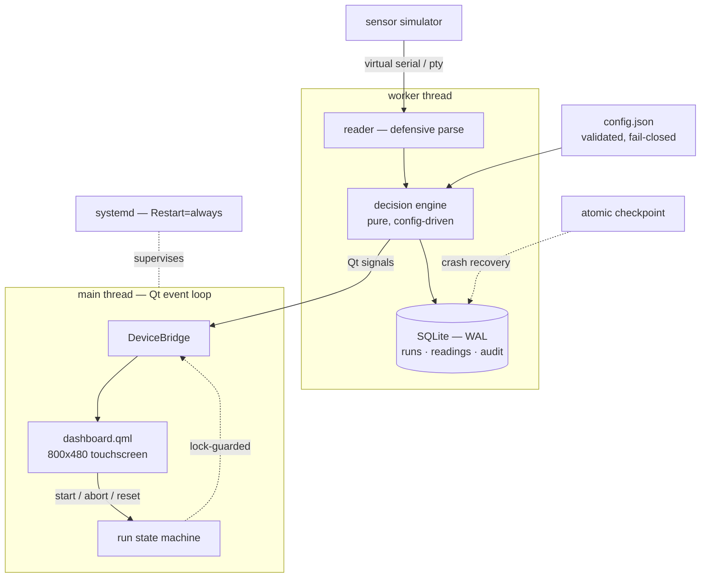

### Device stack

| Layer | Responsibility | Implementation |
|---|---|---|
| Cloud connection | Telemetry out, commands in | Out of scope — this device is offline by design |
| Local UI | Touchscreen, operator workflow | `ui/` |
| Application | Reads inputs, decides, drives outputs | `device_app/` |
| Data | Local storage, audit trail | `device_app/store.py` |
| OS | Service supervision, recovery | `scripts/edge-device.service` |
| Firmware & drivers | Bus-level hardware access | Simulated via pty |
| Physical hardware | Sensors, screen | Simulated |

### Components

| Component | File | Responsibility |
|---|---|---|
| Sensor simulator | `sensor_sim/sensor.py` | Emits readings over a pty as real hardware would |
| Reader | `device_app/reader.py` | Parses the byte stream defensively |
| Decision engine | `device_app/decision.py` | Interprets readings → status + reasons |
| Run state machine | `device_app/run_state.py` | Run lifecycle; illegal transitions impossible |
| Store | `device_app/store.py` | SQLite persistence + hash-chained audit log |
| Config | `device_app/config.py` | Validates configuration; refuses to start if invalid |
| Recovery | `device_app/recovery.py` | Atomic checkpoints, crash recovery, health checks |
| UI bridge | `ui/bridge.py` | Worker thread, Qt signals, thread isolation |
| Dashboard | `ui/dashboard.qml` | 800×480 touchscreen |
| Service unit | `scripts/edge-device.service` | systemd supervision |

### Stack selection

| Component | Chosen | Rationale | Alternative |
|---|---|---|---|
| Language | Python | Fast iteration; strong libraries for serial, UI, and cloud | C++ where timing or performance is critical |
| Serial | pyserial + pty | Real serial API without hardware | Physical UART device |
| UI | Qt/QML (PySide6) | Native, low footprint, touch-first | Web UI — requires a bundled browser engine |
| Database | SQLite (WAL) | Serverless, single-file, offline-native | PostgreSQL — needs a server process |
| Supervision | systemd | Restart-on-crash and start-on-boot, declaratively | Custom init script |
| Configuration | JSON + validation | Behaviour changes without a redeploy | Hard-coded constants |

---

## Running it

```bash
python3 -m venv .venv && source .venv/bin/activate
pip install -r requirements.txt

python3 ui/main.py     # touchscreen UI — tap START
pytest -v              # 39 tests
```

Qt requires a display. On WSL2, WSLg provides one.

### As a service

```bash
sudo cp scripts/edge-device.service /etc/systemd/system/
sudo systemctl daemon-reload
sudo systemctl enable --now edge-device
journalctl -u edge-device -n 20 --no-pager
```

---

# Design

---

## Serial input

Serial (UART) is a stream of bytes over a wire at an agreed baud rate — no request/response, no
framing beyond what the device protocol defines. With no physical hardware available, the sensor
writes into a **pseudo-terminal (pty)**: two linked endpoints where bytes written to one emerge from
the other, and the OS exposes each end as a character device.

The consequence is that `serial.Serial(port, 9600)` is the same call it would be against
`/dev/ttyUSB0`. The application cannot distinguish the simulated sensor from a real one, and
swapping in hardware means changing one function — `_open_port()`.

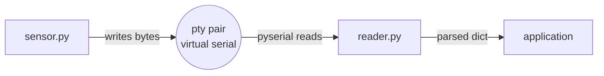

| Approach | Advantage | Cost |
|---|---|---|
| Virtual serial (pty) | Zero hardware, fast iteration, unmodified serial API | No electrical or timing realism; no bus-level debugging |
| Physical hardware | Authentic timing, real fault modes | Cost, slower iteration cycle |

**Parsing is defensive by design:**

```python
try:
    out[key] = float(val)
except ValueError:
    pass          # real serial links drop and corrupt bytes
```

Server-side code can assume well-formed input from a well-behaved client. A device receiving bytes
off a wire cannot. A device that crashes on one malformed line is useless in the field.

---

## The device loop

The application is a continuous loop rather than a request handler: it starts at power-on, reads
from its inputs indefinitely, and stops only when instructed. Three properties follow from that:

- **Bad input is skipped, not fatal.** A read timeout returns empty; a corrupt line parses to
  nothing. Neither warrants a crash.
- **Output goes through `logging`, not `print`.** Levels and timestamps, and `StandardOutput=journal`
  means it lands in `journalctl` with no extra work.
- **Termination is handled.** `SIGINT` and `SIGTERM` set a flag; the loop finishes its current
  iteration and exits on its own terms rather than dying mid-write.

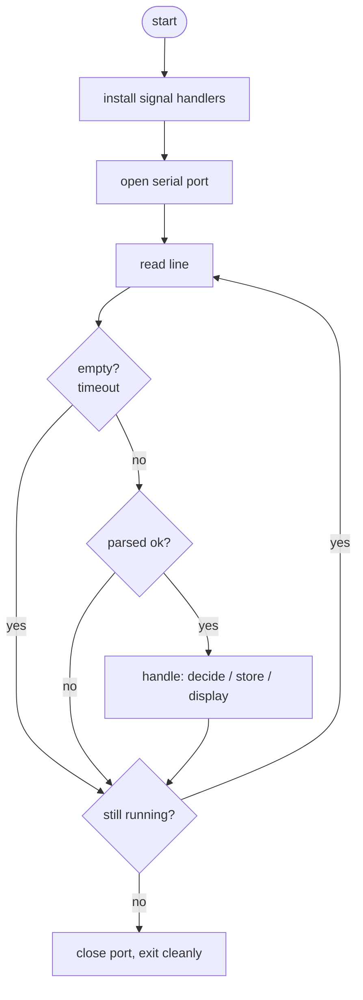

| Choice | Rationale | Cost |
|---|---|---|
| Single loop | Predictable, one thing at a time | Slow work blocks everything — resolved later with worker threads |
| Skip malformed lines | Field resilience | Silent discards can mask real problems |
| Signal-driven shutdown | Resources released, state flushed | Loop must poll the flag |

Graceful shutdown, observed:

```
INFO shutdown signal received
INFO T=25.3C P=1016.8hPa H=39.9%     ← in-flight read completes
INFO stopped cleanly
```

The loop was blocked in `readline()` when the signal arrived. The handler set the flag, the read
returned, the iteration completed, and only then did the loop exit — rather than being terminated
mid-write.

---

## Decision engine

Measurement and interpretation are separated. `decide(reading, rules)` is a pure function: no I/O,
no clock, no randomness. The same reading and rules always produce the same `Result` — a status
(`NORMAL` / `WARNING` / `CRITICAL` / `INVALID`) plus the reasons behind it.

Purity makes the entire decision layer testable without a sensor, a database, or a running device.
Thresholds live in `config.json`, so behaviour changes without a code change. Missing input returns
an explicit `INVALID` rather than a default — a device that reports "normal" when a sensor is
disconnected is worse than one that reports nothing.

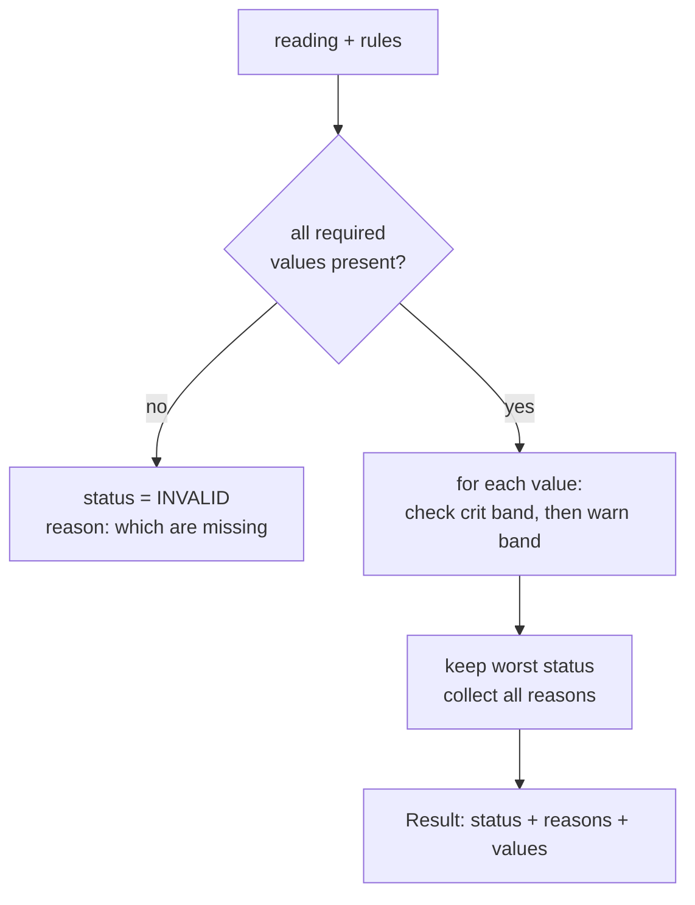

| Choice | Rationale | Cost |
|---|---|---|
| Pure function | Deterministic; testable without hardware | State passed explicitly |
| Config-driven thresholds | Behaviour changes without redeploy | Configuration must be validated |
| Explicit `INVALID` | No confident wrong answers | Additional state for the UI to handle |
| Reasons returned with status | Operator sees why; supports debugging | Marginally more code |
| Worst-status-wins | One unambiguous verdict | All reasons retained to preserve detail |

The critical band is evaluated before the warning band. A value outside critical is also outside
warning, so the order prevents a critical reading being reported as a warning.

Tightening `"T": {"warn": [15, 25]}` in `config.json` flips the same ~25.7 °C readings from
`[normal]` to `[warning]` with the reason attached, with no code modified.

---

## Local storage and the audit chain

The device operates offline, so the local database is the system of record. There is no upstream to
re-sync from; if it is wrong, the data is lost. The implementation reflects that:

- **WAL mode** — writes append to a log before folding into the main file. Readers don't block the
  writer, and a crash mid-write leaves a recoverable log rather than a corrupted database.
- **Transactions** — `with conn:` commits on success and rolls back on exception, so multi-step
  writes are atomic. No half-written runs.
- **Thread discipline** — one connection, owned by the worker thread.
- **Integrity check on startup** — `PRAGMA integrity_check` detects a damaged file before the device
  serves data from it.

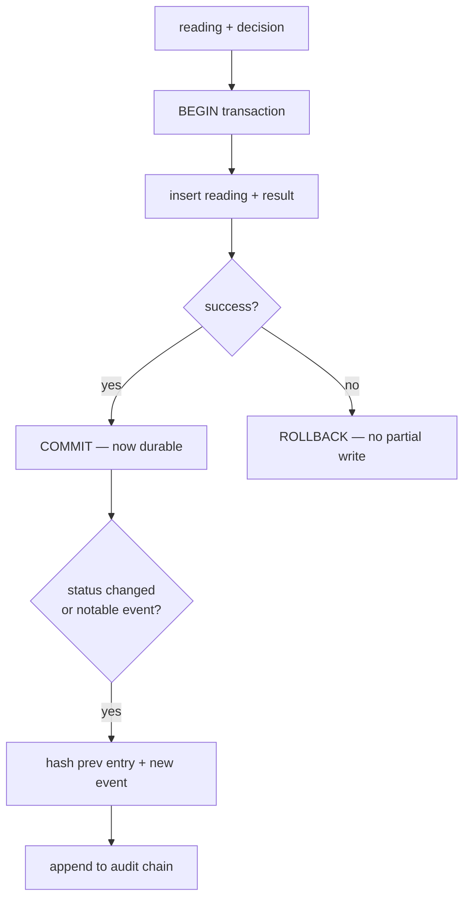

### Hash-chained audit log

The audit table is append-only, and each entry stores the SHA-256 of the previous entry's payload.
Editing or deleting any past row breaks every subsequent hash, so `verify_audit()` detects tampering
rather than merely discouraging it.

`sort_keys=True` when serializing the payload is load-bearing: dictionary ordering must be
deterministic or the same event hashes differently on re-verification and every check fails.

The audit log records **events** — startup, state changes, configuration changes, crash recovery —
not readings. A representative session produced 22 readings and 3 audit entries. Recording data in
the audit log produces a log nobody reads.

| | SQLite (chosen) | PostgreSQL / MySQL |
|---|---|---|
| Setup | Single file, no configuration | Server to install, run, and secure |
| Fit for a single device | Native | Overkill; another process to fail |
| Concurrency | One writer | Many concurrent writers |
| Operations | Application owns backup/recovery | DBA or managed service |

| Choice | Rationale | Cost |
|---|---|---|
| WAL mode | Crash resilience; non-blocking reads | Extra `-wal` / `-shm` files |
| Hash-chained audit | Tampering is detectable | History is genuinely immutable |
| Persist every reading | Full traceability | Storage growth requires pruning |

Verified: editing an audit row directly in SQLite causes startup to report
`audit chain valid: False`.

---

## Configuration

A missing or malformed config file fails loudly and gets fixed. The real hazard is a **silently
wrong** configuration: remove the `"T"` rule and the device runs normally, never evaluates
temperature again, and reports `[normal]` indefinitely.

Validation converts silent wrongness into loud wrongness. `load_config()` checks structure, enforces
that each band is two ordered numbers, and — the non-obvious constraint — that the critical band
*contains* the warning band. Inverted bands produce meaningless output that no runtime check would
catch. Optional keys receive validated defaults.

Invalid configuration stops the device from starting.

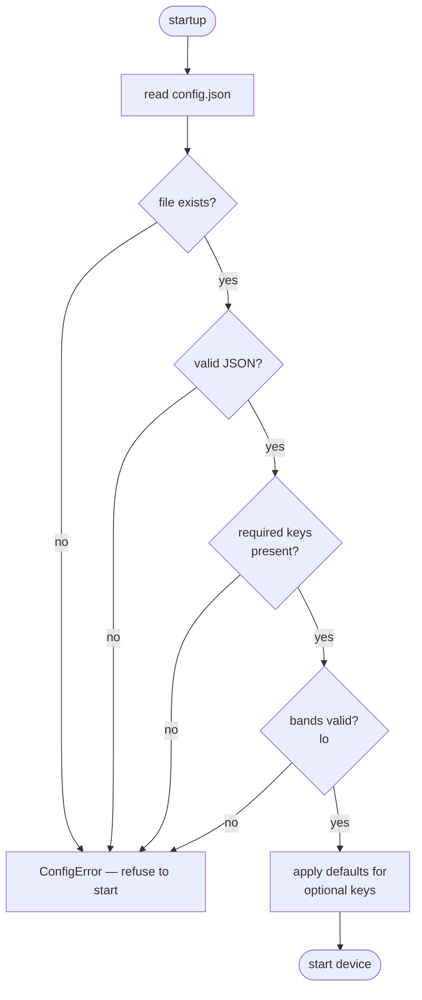

| | Fail closed (chosen) | Fail open (defaults) |
|---|---|---|
| Invalid config | Device refuses to start | Device starts with substituted values |
| Safety | Cannot operate on wrong thresholds | May operate wrongly, silently |
| Availability | Down until corrected | Stays up |
| Appropriate for | Instruments that report verdicts | Best-effort telemetry |

For a device that interprets measurements and reports a result, fail-closed is the correct side of
the trade. A device that is down is obviously broken; a device reporting confident nonsense is not.

Observed:

```
ERROR invalid configuration: rules.P: crit band [1000, 1025] must contain warn band [990, 1035]
ERROR refusing to start — fix config.json and restart
```

The error names the exact key and the exact constraint violated.

---

## Touchscreen UI

The UI runs on the device, fullscreen, with no browser. Qt is the standard framework for embedded
device interfaces; QML describes the screen declaratively and property bindings keep it synchronized
with the model — no manual redraws.

### Thread architecture

The device loop blocks indefinitely. Qt's event loop (`app.exec()`) also blocks indefinitely. They
cannot share a thread. And no GUI toolkit permits a background thread to touch the UI.

The resolution:

- **Main thread** runs Qt's event loop. It renders and handles touch input. Nothing slow executes here.
- **Worker thread** runs the device loop — serial reads, decisions, database writes.
- **Qt signals** carry data between them. Emitting a signal is the only thread-safe path from the
  worker to the UI.

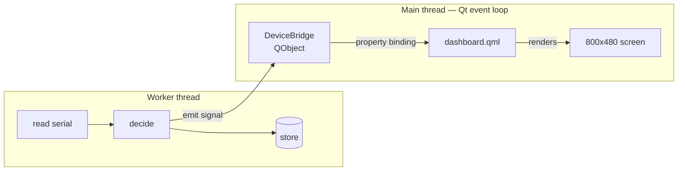

The touchscreen stays responsive regardless of what the device is doing — the worker performs
continuous serial I/O and database writes while the UI renders at full rate.

| | Qt/QML (chosen) | Web UI (Chromium) |
|---|---|---|
| Footprint | Native rendering, low memory | Requires a full browser engine |
| Touch | First-class | Supported, additional layer |
| Startup | Fast | Browser boot time |
| Offline | Native | Works, more moving parts |

| Choice | Rationale | Cost |
|---|---|---|
| Worker thread + signals | UI never blocks; thread-safe by construction | Cross-thread reasoning; timing-dependent bugs |
| Declarative QML | View stays synchronized automatically | Framework-specific syntax |
| 800×480 | Common embedded panel resolution | — |

**Path resolution.** `db_path` resolves relative to the config file, not the working directory.
Launching from `ui/` originally created a second database there; systemd starts services from `/`,
which would have caused the same fault in production. Two tests pin the behaviour:

```python
def test_db_path_resolves_next_to_config(tmp_path): ...
def test_absolute_db_path_is_left_alone(tmp_path): ...
```

---

## Run state machine

The device has modes — idle, running, completed, failed — and illegal actions follow from that: a
run that hasn't started cannot be aborted.

Boolean flags (`is_running`, `is_finished`, `has_failed`) admit eight combinations of which four are
legal, and every call site has to defend itself. A finite state machine declares the states and the
legal transitions in one place; everything else is impossible by construction. One `state` variable,
always valid, and illegal transitions raise rather than corrupt.

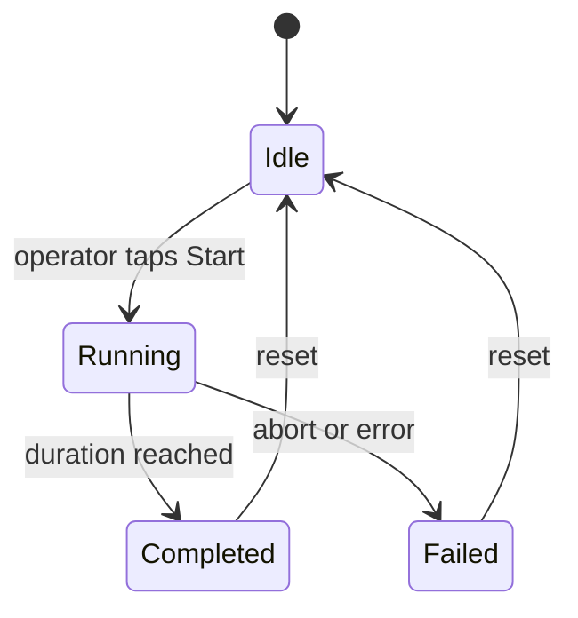

### Concurrency

Two threads transition the machine: the UI thread on Start/Abort, the worker on completion. An abort
landing at the same moment a run completes would race, so transitions are lock-guarded. The abort
flag is a `threading.Event` rather than a plain boolean.

The UI binds directly to the state, which means the controls cannot offer an illegal action:

```qml
TouchButton { label: "START"; active: runState === "idle"; onTapped: device.startRun() }
```

| | FSM (chosen) | Boolean flags |
|---|---|---|
| Illegal states | Impossible by construction | Possible; detected by inspection |
| Adding a state | One entry in the transition map | Audit every conditional |
| UI rendering | Switch on one value | Combinatorial conditionals |

| Choice | Rationale | Cost |
|---|---|---|
| Lock-guarded transitions | Prevents UI/worker races | Must not be held during slow work |
| Abort → FAILED, not COMPLETED | An aborted run has incomplete data | Two paths reach FAILED |
| Cooperative abort | Worker exits at a safe point | Not instantaneous |
| `try/except` around the worker loop | An unhandled exception on a thread dies silently | — |

That last point is load-bearing: without it the thread disappears, the UI reports "running"
indefinitely, and nothing indicates why. Catching it and transitioning to FAILED is the difference
between a device that reports its own failure and one that simply stops.

Cooperative abort, measured:

```
15:09:57,372 INFO abort requested
15:09:57,622 INFO run 9 aborted      ← 250ms
```

250 ms is one sample interval at 4 Hz. The worker was blocked in `readline()`, the event fired, it
completed the iteration, closed the port, wrote the outcome, and exited — not killed mid-write.

---

## Reliability and recovery

Everything above assumes an orderly exit. Devices don't get that guarantee: power cuts, OOM kills,
and unhandled faults happen with nobody present.

**The orphaned run.** If the application dies mid-run, the database still holds:

```
13|1784265618.56957||running
```

That row claims `running` indefinitely. The application restarts, opens run 14, and run 13
misreports forever.

### Checkpointing

An in-progress run writes a checkpoint every two seconds, atomically. `open(path, "w")` truncates
immediately, so a crash mid-write leaves a corrupt file — worse than none. Instead: write to a temp
file, `fsync` it, then `os.replace()`. Rename is atomic, so the checkpoint is either entirely the
previous version or entirely the new one.

`fsync` matters: `flush()` only moves bytes into the OS page cache. Without it, atomic rename
survives a crashed process but not a power loss.

### Startup recovery

A surviving checkpoint or a run still marked `running` means the previous session died mid-flight.
Those runs are marked `failed` and the recovery is written to the audit log.

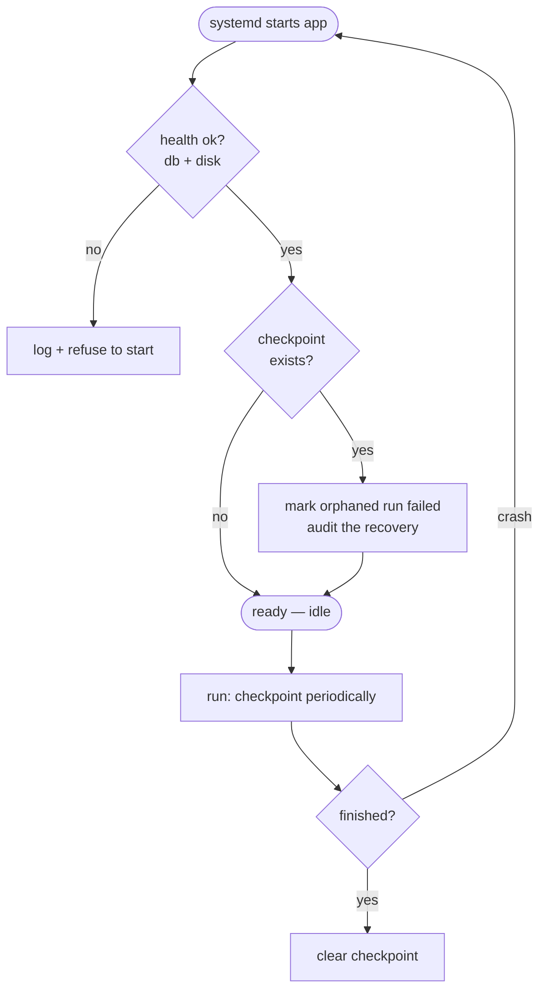

### Boot sequence

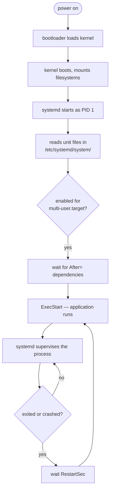

`enable` writes a symlink into `multi-user.target.wants/` — that is what starts the application at
boot. `Restart=always` is what restarts it when it dies. The two are independent.

| Choice | Rationale | Cost |
|---|---|---|
| Atomic write (temp + fsync + rename) | Never a partial checkpoint | Two syscalls instead of one |
| Checkpoint on interval, not per reading | Bounded write churn | Up to N seconds of state loss |
| Mark orphaned runs failed, don't resume | The data has an unknown gap | Discards a run that may have been sound |
| `Restart=always` | Self-healing with no application code | Masks crash loops without a start limit |
| Health check before start | Refuses to operate degraded | Another failure path at startup |

**Resume versus fail.** An orphaned run could be resumed. It isn't. The device was off for an
unknown interval, so the readings have a hole. A measurement with a silent gap is worse than an
honest failure.

### Service unit

```ini
[Unit]
Description=Edge Device Monitor
StartLimitBurst=5              # after 5 failures...
StartLimitIntervalSec=60       # ...in 60s, stop retrying and surface the fault
After=network.target

[Service]
Type=simple
User=chetan                    # least privilege
WorkingDirectory=/home/chetan/edge-device   # systemd otherwise starts services from /
Environment=DISPLAY=:0         # services inherit no environment
Environment=WAYLAND_DISPLAY=wayland-0
Environment=XDG_RUNTIME_DIR=/run/user/1000
Environment=QT_QPA_PLATFORM=wayland
ExecStart=/home/chetan/edge-device/.venv/bin/python3 /home/chetan/edge-device/ui/main.py
Restart=always
RestartSec=3                   # delay prevents a crash loop saturating a core
StandardOutput=journal
StandardError=journal

[Install]
WantedBy=multi-user.target
```

`ExecStart` uses absolute paths for both interpreter and script — systemd provides no `PATH`, no
shell, and no virtualenv activation.

### Verified behaviour

Crash recovery, after `kill -9` mid-run:

```
INFO health ok — 973639MB free
WARNING run 13 was interrupted — marking failed
```

systemd self-healing, after `kill -9` on the service:

```
00:44:06  Main process exited, code=killed, status=9/KILL
00:44:09  Scheduled restart job, restart counter is at 2.
00:44:09  Started edge-device.service
00:44:10  INFO health ok
```

Killed at :06, running at :09 with a new PID — `RestartSec=3`.

Full operator cycle under systemd:

```
00:34:12  Started edge-device.service
00:34:12  INFO health ok — 973642MB free
00:34:23  INFO run 18 started
00:34:23  INFO run 18 reading on /dev/pts/9
00:34:38  INFO run 18 completed
00:35:19  INFO stopped cleanly
00:35:19  edge-device.service: Deactivated successfully.
00:35:19  Consumed 22.039s CPU time, 2.4M memory peak
```

systemd launched the application, the touchscreen came up, the operator started a run, the state
machine carried it to completion, and shutdown was clean. Peak memory 2.4 MB.

### Crash evidence in the audit trail

Every clean session terminates with a `shutdown` audit entry. The crashed session reads:

```
{"action": "startup", "device": "edge-01"}
{"action": "state_change", "to": "running"}
{"action": "status_change", ... "to": "normal"}
                                              ← no shutdown entry
{"action": "crash_recovery", "run_id": 13, "resolution": "marked failed"}
```

The absent shutdown entry is itself evidence of the failure, and the following session's
`crash_recovery` records the resolution. Both sit inside the hash chain, so neither can be edited
away afterwards.

---

# Planned work

## Control API — REST + WebSocket

Separate the application (UI, logic, storage) from a device-service that owns hardware access, with
REST for commands and a WebSocket for live events.

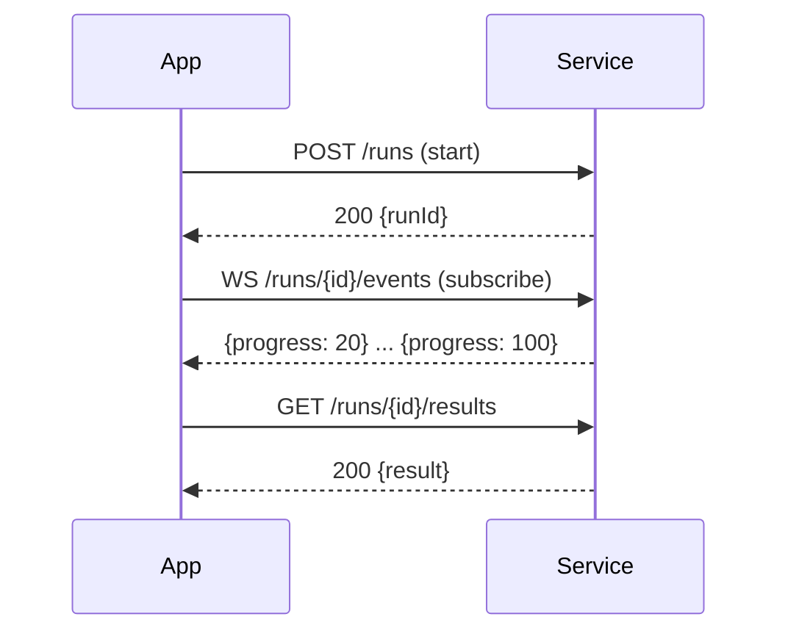

Endpoints: `POST /runs`, `POST /runs/{id}/abort`, `GET /runs/{id}/status`, `GET /runs/{id}/results`,
`GET /health`, `WS /runs/{id}/events`.

Requirements: idempotent commands (a repeated abort or retried start must be safe), per-call
timeouts with backed-off retry, typed error mapping, heartbeats and reconnection.

| | REST | WebSocket |
|---|---|---|
| Suited to | Commands, queries | Live event streams |
| Model | Request/response | Persistent, server-push |
| Used for | start / abort / status | progress, state changes |

This also resolves a known constraint: the systemd service and a manually launched UI both write
`device.db`, and SQLite permits one writer. One process owning the database, with everything else
going through the API, is the correct structure.

## Local authentication and roles

No cloud identity provider is reachable offline. Credentials are stored locally, salted and hashed
with bcrypt (never plaintext, never a fast hash). Roles map to permissions; sessions expire;
sensitive operations are permission-gated and audited.

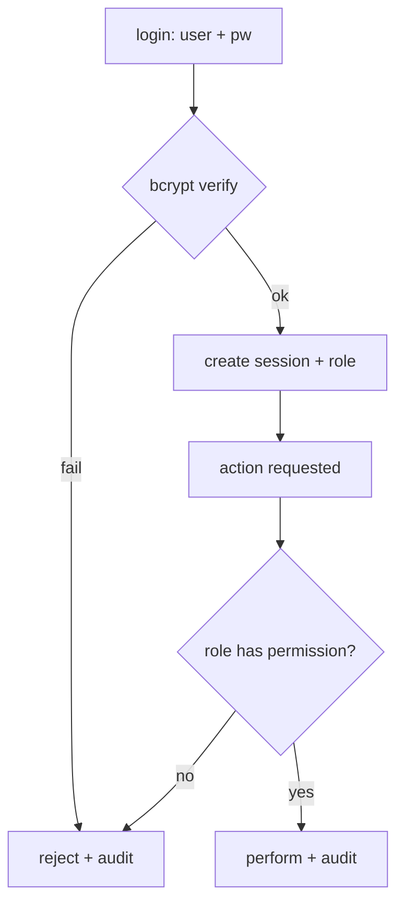

Roles: operator, supervisor, admin. Integrates with the existing audit chain.

## Signed updates and removable-media security

Removable media is treated as untrusted input.

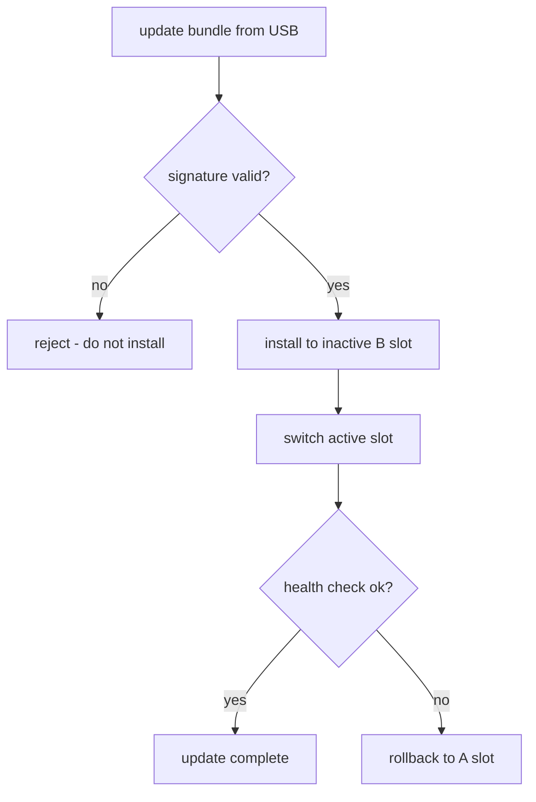

| | Checksum (SHA-256) | Digital signature |
|---|---|---|
| Detects accidental corruption | Yes | Yes |
| Proves origin | No — anyone can recompute it | Yes — requires the private key |
| Sufficient for updates | No | Required |

| | In-place update | A/B slots + rollback |
|---|---|---|
| Complexity | Lower | Two slots to manage |
| Failure mode | Can brick the device | Automatic rollback |

Signature verification precedes installation, never follows it. Nothing on the media is executed.

## Cross-layer debugging

The stack runs UI → application → local API → device-service → firmware → hardware. Faults are
localized by bisecting at the boundaries rather than assuming.

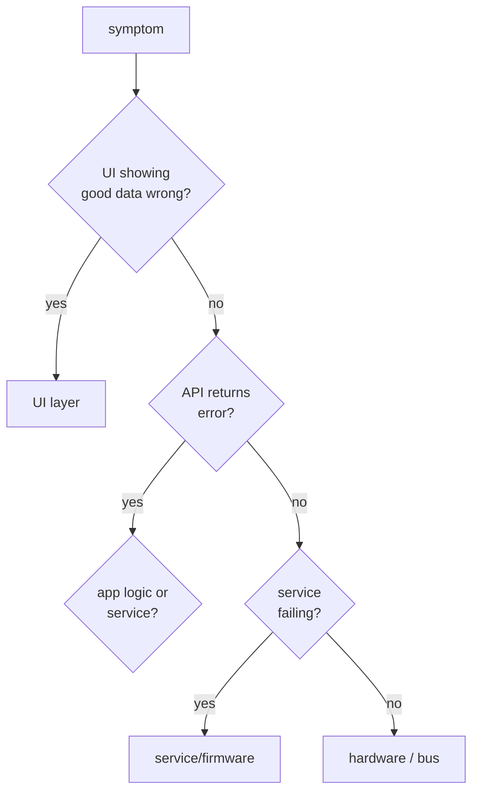

Probes: `journalctl` and structured logs for application and services, `curl` at the API boundary,
`strace` / `gdb` for a stuck process, bus inspection and `dmesg` at the hardware edge.

The instrumentation already exists — structured logging, the audit trail, health checks, and a pure
testable decision function.

---

# Tests

39 tests, no hardware required. The decision engine, state machine, config validator, audit chain,
and recovery logic are pure enough to test directly.

```
tests/test_decision.py     thresholds, boundaries, worst-status-wins, invalid input
tests/test_config.py       validation, defaults, fail-closed, path resolution
tests/test_store.py        persistence, audit chain verification, tamper detection
tests/test_run_state.py    legal/illegal transitions, state preserved after rejection
tests/test_recovery.py     atomic writes, corrupt checkpoints, health checks
```

Notable:

- `test_tampering_is_detected` — asserts a security property directly.
- `test_failed_state_survives_illegal_attempt` — a rejected transition leaves state untouched rather
  than half-applied.
- `test_db_path_resolves_next_to_config` — pins the working-directory fault described above.

---

# Faults found during development

| Fault | Symptom | Root cause | Resolution |
|---|---|---|---|
| Duplicate database | Run counter reset to 1 | `open_db("device.db")` resolved against the working directory | Resolve paths relative to the config file |
| Inverted log levels | Nominal readings logged as ERROR | `!=` where `==` was intended; execution fell to `else` | Corrected branch order |
| Duplicate startup log | `config loaded` emitted twice | Duplicate call site | Removed |
| systemd crash loop | 122 restarts, each reported as "Started" | `QT_QPA_PLATFORM=xcb` forced a platform that cannot initialize in this session | Use `wayland`; add `StartLimitBurst` to surface the fault |
| Ignored unit keys | No effect, no error | `StartLimit*` moved to `[Unit]` in systemd 229 | Relocated; validated with `systemd-analyze verify` |

**Known limitation.** `systemctl stop` does not produce `stopped cleanly` — Qt's C++ event loop
never returns control to the Python interpreter, so the `SIGTERM` handler doesn't run. A stop
mid-run leaves an orphaned run, which startup recovery then resolves. The correct fix is a
`QSocketNotifier`-based signal bridge.

---

# Reference

## Commands

```bash
# environment
python3 -m venv .venv && source .venv/bin/activate
pip install -r requirements.txt

# run
python3 ui/main.py                    # touchscreen UI
pytest -v                             # tests

# systemd
sudo cp scripts/edge-device.service /etc/systemd/system/
sudo systemctl daemon-reload
sudo systemctl enable --now edge-device
systemctl status edge-device
systemd-analyze verify /etc/systemd/system/edge-device.service
journalctl -u edge-device -n 20 --no-pager
sudo systemctl disable --now edge-device

# database
sqlite3 device.db "SELECT * FROM runs;"
sqlite3 device.db "SELECT id, event, substr(hash,1,12) FROM audit;"
sqlite3 device.db "PRAGMA integrity_check;"
```

## Reproducing the safety behaviours

```bash
# Fail-closed config — invert a band in config.json, then:
python3 ui/main.py                # refuses to start, names the offending key

# Tamper detection:
sqlite3 device.db "UPDATE audit SET event='{\"action\":\"nothing\"}' WHERE id=1;"
python3 ui/main.py                # reports: audit chain valid: False

# Crash recovery — start a run, then from another terminal:
pkill -9 -f "python3 ui/main.py"  # SIGKILL: no cleanup, simulates power loss
python3 ui/main.py                # "run N was interrupted — marking failed"
```

## Design decisions, summarized

- **Python over C++** — iteration speed for application logic; C++ where timing or performance is
  critical.
- **Virtual over physical serial** — identical API, no electrical or timing realism.
- **SQLite over PostgreSQL** — serverless and single-file suits one offline device.
- **Qt over a web UI** — native rendering; a browser engine is heavy on a device.
- **FSM over flags** — illegal states become impossible; the UI gets one source of truth.
- **Signature over checksum** — a checksum catches corruption; only a signature proves origin.
- **A/B over in-place update** — more storage, automatic recovery from a bad update.
- **bcrypt over a fast hash** — deliberate slowness resists brute force.
- **REST + WebSocket** — commands and queries over REST; live streams over WebSocket.
- **Worker threads over a single loop** — long work offloaded so the UI never blocks.
- **Fail closed over fail open** — a device that is down is obviously broken; one reporting
  confident nonsense is not.
- **Fail an interrupted run rather than resume it** — an honest failure beats a silent gap.

---

# Scope

Covers the embedded Linux application layer end to end: device-side architecture, serial I/O,
offline data integrity, touchscreen UI, thread isolation, lifecycle management, and crash recovery.

Does not cover hardware bring-up, firmware, or bus-level debugging with a scope or logic analyzer —
those require physical hardware.

On running a GUI under systemd: a production instrument has no X server or Wayland compositor. Qt
renders directly to the framebuffer via `eglfs` or `linuxfb`. WSLg provides a desktop-style session,
which is precisely what a device lacks — the platform plugin list from a failed start
(`linuxfb, minimalegl, eglfs, ...`) is the embedded set.

## Stack

Python · pyserial · Qt/QML (PySide6) · SQLite · systemd · pytest